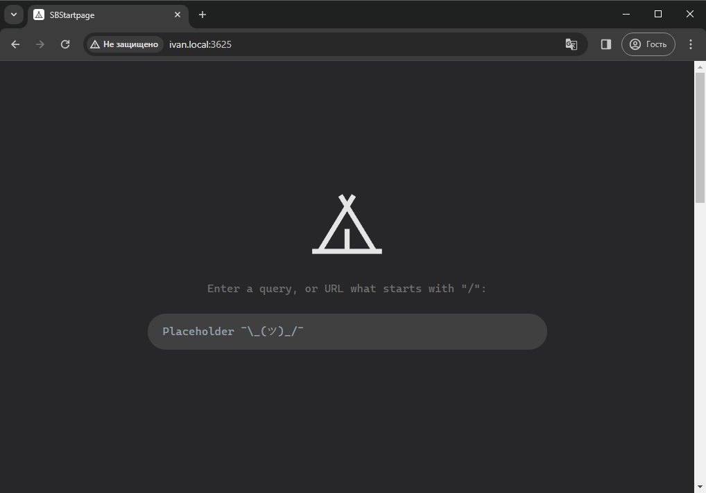
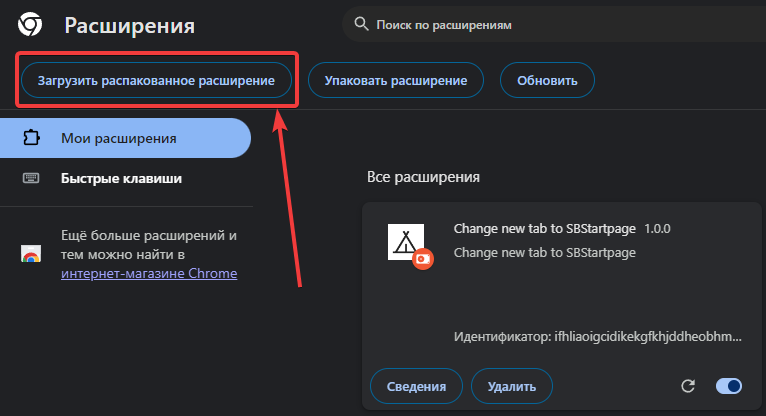

# SBStartpage

My start page.

## How to install

1. Build project with `pnpm build`
2. Serve `dist` directory with any server (for example, [miniserve](https://github.com/svenstaro/miniserve))
3. Install extension from `extension` folder:

   
